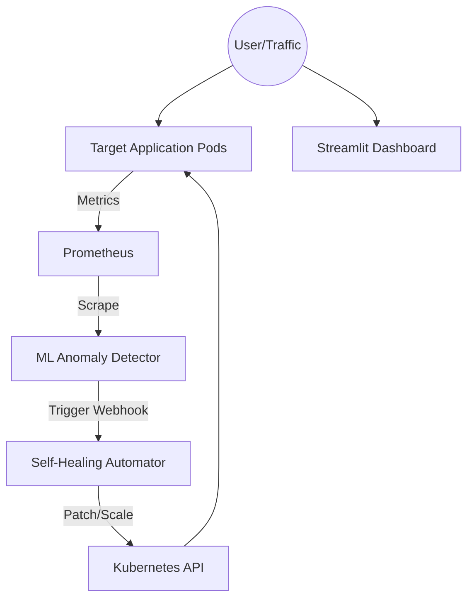

# 🚀 AI-Powered Self-Healing Infrastructure

This project demonstrates a fully open-source, production-grade **Self-Healing Infrastructure** using Kubernetes, Prometheus, Machine Learning (Isolation Forest), and Python automation.

**Live Interactive Demo:** Deploy the frontend instantly to [Streamlit Community Cloud](https://share.streamlit.io/deploy?repository=ayeswar/self-healing-infra&branch=main&mainModule=frontend/streamlit_app.py) for free!

---

## 🌟 Features
- **Application Monitoring**: Real-time metrics scraped via Prometheus.
- **Machine Learning Anomaly Detection**: An ML model continuously queries Prometheus for CPU/Memory metrics. It uses an `Isolation Forest` algorithm (via scikit-learn) to detect anomalous usage (e.g., sudden spikes, memory leaks).
- **Automated Self-Healing**: When an anomaly is detected, a Python automation bot securely interacts with the Kubernetes API to patch, scale, or restart struggling pods to handle the load automatically.
- **Interactive Dashboard**: A Streamlit frontend UI that simulates and visualizes the ML model, CPU traffic, and Kubernetes scaling.
- **CI/CD Pipeline**: Fully automated GitHub Actions workflow for testing and building Docker images.

---

## 🏗️ Architecture



---

## ☁️ Free Cloud Deployment (Streamlit Dashboard)

You can easily deploy the frontend UI to the public internet for **free** to showcase the project to others:

1. Click here: **[Deploy to Streamlit](https://share.streamlit.io/deploy?repository=ayeswar/self-healing-infra&branch=main&mainModule=frontend/streamlit_app.py)**
2. Log in with your GitHub account.
3. Click the **Deploy** button.
4. Your dashboard will be live in 2 minutes and you can click the "Simulate CPU Spike" button to watch the AI scale the infrastructure!

---

## 🚀 Quick Start (Local Kubernetes Deployment)

To run the complete infrastructure (the actual Kubernetes backend) locally, we use **Minikube**.

### Prerequisites
- Docker & Minikube
- `kubectl`
- Helm (for installing Prometheus)

### Step 1: Start Minikube & Build Images
```bash
minikube start --memory=4096 --cpus=4
eval $(minikube docker-env) # Point shell to minikube's docker-daemon

# Build images
docker build -t self-healing-app:latest ./app
docker build -t ml-anomaly-detector:latest ./ml_anomaly_detector
docker build -t self-healer:latest ./self_healer
```

### Step 2: Install Prometheus & Deploy Infrastructure
```bash
helm repo add prometheus-community https://prometheus-community.github.io/helm-charts
helm install prometheus prometheus-community/prometheus -f k8s/monitoring/prometheus-values.yaml

# Deploy App, Healer Bot (with RBAC), and ML Detector
kubectl apply -f k8s/app/
kubectl apply -f k8s/healer/
kubectl apply -f k8s/ml_detector/
```

### Step 3: Test the Self-Healing Live!

You can run our automated PowerShell script to watch the magic happen:
```powershell
powershell -ExecutionPolicy Bypass -File demo.ps1
```

**Or do it manually:**
1. Trigger a simulated **CPU Spike**:
   ```bash
   curl "http://localhost:30080/stress-cpu?duration=30"
   ```
2. Watch the ML detector catch it and trigger the healer:
   ```bash
   kubectl logs -l app=ml-anomaly-detector --tail=10
   kubectl logs -l app=self-healer --tail=10
   ```
3. Watch Kubernetes automatically spin up new pods to handle the load:
   ```bash
   kubectl get pods -l app=self-healing-app -w
   ```

---

## 🗂️ Repository Structure

- `app/`: Target FastAPI app that exposes endpoints to simulate CPU/Memory stress.
- `k8s/`: Kubernetes YAML manifests for the App, Healer bot, and Prometheus.
- `ml_anomaly_detector/`: Python scikit-learn service that polls metrics and predicts anomalies.
- `self_healer/`: Python Flask service that acts as a webhook receiver and Kubernetes API client.
- `frontend/`: Streamlit dashboard for real-time visualization.
- `demo.ps1`: Automated script to run the local Kubernetes demonstration.
- `.github/workflows/`: CI/CD configuration.
