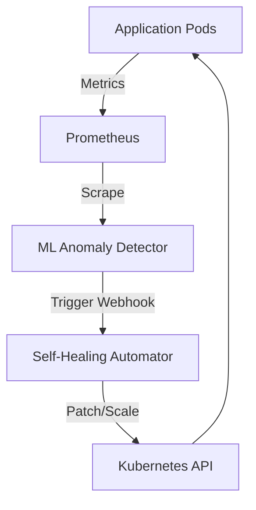

# AI-Powered Self-Healing Infrastructure

This project demonstrates a fully open-source, production-grade **Self-Healing Infrastructure** using Kubernetes, Prometheus, Machine Learning (Isolation Forest), and Python automation.

## Features
- **Application Monitoring**: Real-time metrics scraped via Prometheus.
- **Anomaly Detection**: An ML model continuously queries Prometheus for CPU/Memory metrics. It uses an Isolation Forest algorithm to detect anomalous usage (e.g., sudden spikes, memory leaks).
- **Self-Healing**: When an anomaly is detected, a Python automation bot securely interacts with the Kubernetes API to restart struggling pods or scale up deployments to handle the load.
- **CI/CD**: Fully automated GitHub Actions pipeline for testing and building Docker images.

---

## 🏗️ Architecture



---

## 🚀 Quick Start (Local Minikube Deployment)

Since this project avoids paid services, we will deploy it locally using **Minikube**.

### Prerequisites
- Docker
- Minikube
- `kubectl`
- Helm (for installing Prometheus)

### Step 1: Start Minikube
```bash
minikube start --memory=4096 --cpus=4
```

### Step 2: Build Docker Images directly into Minikube
We want Minikube to use our locally built images instead of pulling from Docker Hub.

```bash
# Point your shell to minikube's docker-daemon
eval $(minikube docker-env)

# Build App
cd app
docker build -t self-healing-app:latest .
cd ..

# Build ML Detector
cd ml_anomaly_detector
docker build -t ml-anomaly-detector:latest .
cd ..

# Build Healer Bot
cd self_healer
docker build -t self-healer:latest .
cd ..
```

### Step 3: Install Prometheus
We use Helm to deploy Prometheus into the cluster quickly.

```bash
helm repo add prometheus-community https://prometheus-community.github.io/helm-charts
helm repo update
helm install prometheus prometheus-community/prometheus -f k8s/monitoring/prometheus-values.yaml
```

### Step 4: Deploy the System
Now deploy the App, the Healer bot (with its RBAC permissions), and the ML Detector.

```bash
# Deploy Target App
kubectl apply -f k8s/app/deployment.yaml
kubectl apply -f k8s/app/service.yaml

# Deploy Self-Healer Bot
kubectl apply -f k8s/healer/rbac.yaml
kubectl apply -f k8s/healer/deployment.yaml
kubectl apply -f k8s/healer/service.yaml

# Deploy ML Anomaly Detector
kubectl apply -f k8s/ml_detector/deployment.yaml
```

### Step 5: Test the Self-Healing

1. Port-forward the application so you can hit its endpoints:
   ```bash
   kubectl port-forward svc/self-healing-app-svc 8000:8000
   ```

2. Trigger a simulated **CPU Spike**:
   ```bash
   curl "http://localhost:8000/stress-cpu?duration=30"
   ```

3. Watch the magic happen:
   - Prometheus will detect the CPU spike.
   - `ml-anomaly-detector` will poll Prometheus, see the anomaly, and send an alert to `self-healer`.
   - `self-healer` will automatically scale up the `self-healing-app` deployment to handle the load.
   
   Verify by running:
   ```bash
   kubectl get pods -w
   ```
   *You should see new pods spinning up automatically!*

---

## 🗂️ Folder Structure

- `app/`: Target FastAPI app that exposes endpoints to simulate CPU/Memory stress.
- `k8s/`: Kubernetes YAML manifests for the App, Healer bot, and Prometheus.
- `ml_anomaly_detector/`: Python scikit-learn service that polls metrics and predicts anomalies.
- `self_healer/`: Python Flask service that acts as a webhook receiver and Kubernetes API client.
- `.github/workflows/`: CI/CD configuration.
